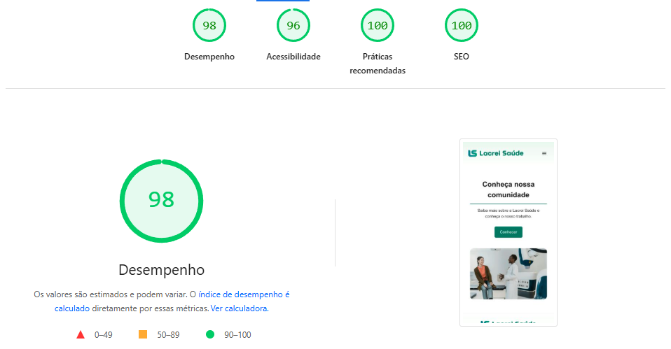

# Desafio Lacrei Saude

Este projeto e uma aplicacao web desenvolvida como parte do desafio tecnico da Lacrei Saude. O objetivo e criar uma interface acessivel, responsiva e performatica.

## Instrucoes para rodar o projeto localmente

Pre-requisitos: Node.js (versao 18 ou superior) e npm.

1. Clone o repositório:
   git clone https://github.com/Arthur-GitEst/desafio-lacrei-saude.git

2. Acesse o diretório do projeto:
   cd desafio-lacrei-saude

3. Instale as dependências:
   npm install

4. Execute o servidor de desenvolvimento:
   npm run dev

5. Acesse a aplicação no navegador em: http://localhost:3000

## Instrucoes para build e deploy

### Build Local

Para gerar uma versão otimizada para produção localmente:

1. Execute o comando de build:
   npm run build

2. Inicie o servidor de producao:
   npm start

### Deploy

O projeto foi configurado para deploy na plataforma Vercel.

1. Conecte o repositório GitHub a Vercel.
2. As configurações de build (npm run build) e output são detectadas automaticamente.
3. Cada push na branch main dispara um novo deploy de produção.

## Proposta de Rollback

### Rollback Simples (Via Git)

Caso seja necessário reverter uma alteração no codigo fonte:

1. Identifique o hash do commit estavel anterior.
2. Execute: git revert <hash-do-commit-problematico>
3. Faca o push da alteração para a branch main.
4. O pipeline de deploy da Vercel atualizará a produçãoo automaticamente.

### Rollback Funcional (Via Plataforma Vercel)

Para uma restauracao imediata sem alteracao de codigo (Instant Rollback):

1. Acesse o dashboard do projeto na Vercel.
2. Vá ate a aba "Deployments".
3. Localize o deploy anterior que estava estável.
4. Clique no menu de opções (tres pontos) e selecione "Instant Rollback".
5. A versão anterior sera promovida a produção instantaneamente.

## Comentarios sobre as escolhas visuais e tecnicas

### Escolhas Tecnicas

- Next.js 16 (App Router): Escolhido pela performance, otimizacao de SEO nativa e arquitetura moderna baseada em Server Components.
- TypeScript: Adotado para garantir tipagem estática, reduzindo erros em tempo de execução e melhorando a manutenção do código.
- Sharp: Biblioteca adicionada para otimização de imagens em produção, essencial para a performance do Next.js.

### Escolhas Visuais

- Paleta de Cores: Foram utilizadas as cores da marca (tons de esmeralda e verde) para transmitir confiança, saúde e acolhimento. O uso de cinzas neutros para textos garante boa legibilidade.
- Tipografia: A fonte 'Nunito' foi usada para títulos por sua característica amigável e arredondada, enquanto a 'Inter' ou fontes padrão sans-serif foram usadas para corpo de texto visando clareza.
- Layout Limpo: O design prioriza o espaço em branco (whitespace) para evitar sobrecarga cognitiva e focar na mensagem de inclusão.

### Justificativas

A arquitetura foi pensada para ser escalável. A separação de componentes (Header, Footer, Hero) facilita a reutilização e manutenção. A preocupação com acessibilidade (uso de tags semânticas como main, section, nav e atributos aria) reflete o core business da Lacrei Saúde: a inclusão.

- TypeScript: Adotado para garantir tipagem estatica, reduzindo erros em tempo de execucao e melhorando a manutencao do codigo.
- Sharp: Biblioteca adicionada para otimizacao de imagens em producao, essencial para a performance do Next.js.

### Escolhas Visuais

- Paleta de Cores: Foram utilizadas as cores da marca (tons de esmeralda e verde) para transmitir confianca, saude e acolhimento. O uso de cinzas neutros para textos garante boa legibilidade.
- Tipografia: A fonte 'Nunito' foi usada para titulos por sua caracteristica amigavel e arredondada, enquanto a 'Inter' ou fontes padrao sans-serif foram usadas para corpo de texto visando clareza.
- Layout Limpo: O design prioriza o espaco em branco (whitespace) para evitar sobrecarga cognitiva e focar na mensagem de inclusao.

### Justificativas

A arquitetura foi pensada para ser escalavel. A separacao de componentes (Header, Footer, Hero) facilita a reutilizacao e manutencao. A preocupacao com acessibilidade (uso de tags semanticas como main, section, nav e atributos aria) reflete o core business da Lacrei Saude: a inclusao.

## Otimização

### Métodos de Desempenho Utilizados

Para garantir uma experiência de usuário fluida e rápida, foram aplicadas as seguintes técnicas de otimização:

- **Next/Image:** Utilização do componente nativo de imagens do Next.js para carregamento lazy (lazy loading), redimensionamento automático e conversão para formatos modernos como WebP.
- **Code Splitting:** O Next.js realiza automaticamente a divisão de código por rota, garantindo que apenas o JavaScript necessário para a página atual seja carregado.
- **Font Optimization:** Uso do `next/font` para carregar fontes de forma otimizada, evitando Layout Shift (CLS) e melhorando o tempo de carregamento.
- **Server Components:** A maior parte da renderização ocorre no servidor, reduzindo o tamanho do bundle enviado para o cliente e acelerando o First Contentful Paint (FCP).

### Teste Lighthouse

O projeto foi auditado utilizando a ferramenta Google Lighthouse para garantir métricas de qualidade. Os resultados obtidos refletem o compromisso com a performance e acessibilidade:

- **Desempenho:** 98
- **Acessibilidade:** 96
- **Best Practices:** 100
- **SEO:** 100

Esses resultados confirmam que a aplicação é rápida, acessível para leitores de tela e segue as melhores práticas de desenvolvimento web moderno.
